__INFORMACION DE LA GUIA__

La guía esta creada para los usuarios que desean y requieren desarrollar su propio BOT discord, ya sea para su servidor privado o al publico\. Toda la información y ejemplos de esta guía, estan basadas en la documentación oficial de Discord\.js y DiscordAPI\.

Esta guía te llevará a través de los primeros pasos de la creación de un BOT, la configuración, la adición de comandos y mas\. Utilizando la libreria [Discord\.js](https://discord.js.org/#/docs/main/stable/general/welcome)

  
__CONTENIDO__

  Instalación y uso de un editor de código\.

  Creación de su cuenta App y de Bot\.

  Instalación de Discord\.js y Node\.js\.

  En marcha su primer bot\.

  Uso de un prefix\.

  Uso del texto embed\.

  Uso de argumentos\.

  Ejemplos basicos\.

  Uso de eventos\.

  Uso de colecciones\.

  Uso de roles\.

  Introducción a un bot de música/audio\.

__PASO 1 INSTALACION Y USO DE UN EDITOR DE CODIGO__

Un buen editor de codigo nos ayudara a simplificar y mejorar su codigo legible, nos dira donde estan los errores, validar y en algunos ejecutar su codigo por usted\.

Para los capitulos y ejemplos de la guia vamos a utilizar el editor Visual Studio Code, es un editor de codigo fuente muy ligero y potente que soportar diferentes lenguajes de programación como: \(\.JS, C \+\+, C \#, Python, PHP, Go\) y runtimes \(como \.NET y Unity\), adaptable para Windows, macOS y Linux\. Muy recomendado\.

  
__COMO INSTALAR VISUAL STUDIO CODE \(VSCode\)__

Seguir estos pasos:

  Ingresar a la pagina web de [Visual Studio Code](https://code.visualstudio.com/download)\.

  Descargar la version que se adapte a su PC\.

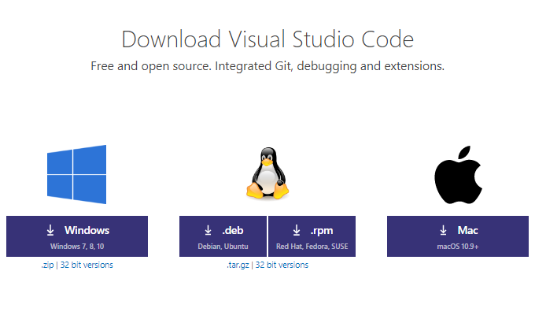

  Una vez descargado, ejecute el instalador \(VSCodeSetup\-version\)\.exe, esto sólo tomará unos minuto\.

Pasos adicionales que le ayudarán a aprender más sobre VS Code: \(Estos pasos solo son recomendaciones de ayuda, no es necesario seguirlos\)\.

  [Interfaz de usuario](https://code.visualstudio.com/docs/getstarted/userinterface) \- Una orientación rápida a la interfaz de VSCode\.

  [Componentes adicionales:](https://code.visualstudio.com/docs/setup/additional-components) Aprenda a instalar Git, TypeScritp y otras herramientas\.

  [Guia VSCode](https://code.visualstudio.com/docs/editor/codebasics), edición basica\.

  Mas detalles sobre el uso de VSCode, Ingrese a [VSCode](https://code.visualstudio.com/docs/getstarted/userinterface" \t "_blank)[ interface](https://code.visualstudio.com/docs/getstarted/userinterface" \t "_blank)

  
__USO DE VISUAL STUDIO CODE__

VS Code comienza con una interfaz sencilla, con una pantalla agradable de bienvenida y una guía de uso\. Tiene la capacidad de abrir una carpeta de proyecto para que no tenga que seguir abriendo los archivos individualmente y crear grupos de trabajos entre carpetas\.

  Abrir VSCode\.

  Vaya a "Archivos" \-> "Abrir Carpeta" o \(CTROL \+ O\)

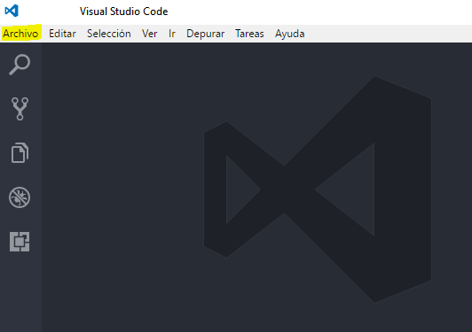

  Ubicar la carpeta principal y haga clic Seleccionar Carpeta \(Sus archivos no aparecerán, sólo la estructura de la carpeta\), o arrastre la carpeta dentro de VSCode\.

A la izquierda del editor tendrás todos los archivos de la carpeta\. Simplemente haga doble clic en cualquiera de ellos para visualizar y empezar a editar\. Para limpiar las cosas, puede cerrar la pantalla de bienvenida y tal\.

  
__OTRO EDITORES DE CODIGO__

Hay muchas otras alternativas para poder editar su codigo, esta es una pequeña lista\. Tendrá que buscar instrucciones específicas para estos editores por tu cuenta si desea instalarlos y usarlos\.

  [Notepad\+\+](https://notepad-plus-plus.org/download/v7.4.2.html)

  [Brackets](http://brackets.io/)

  [Sublime Text 3](https://www.sublimetext.com/3)

  [Atom](https://atom.io/)

No utilice el bloc de notas, no es suficiente

__PASO 2 CREACION DE SU CUENTA APP Y BOT DISCORD__

El primer paso para crear un primer BOT es crear una aplicación Discord\. El bot utilizará la API de Discord, que requiere la creación de una cuenta Discord para propósitos de autenticación\. No te preocupes, es súper simple\.

Para crear la aplicación, diríjase a la página de [discordapp\.com aplicación](https://discordapp.com/developers/applications/me) e inicie sesión, llegará a una página que se vera así:

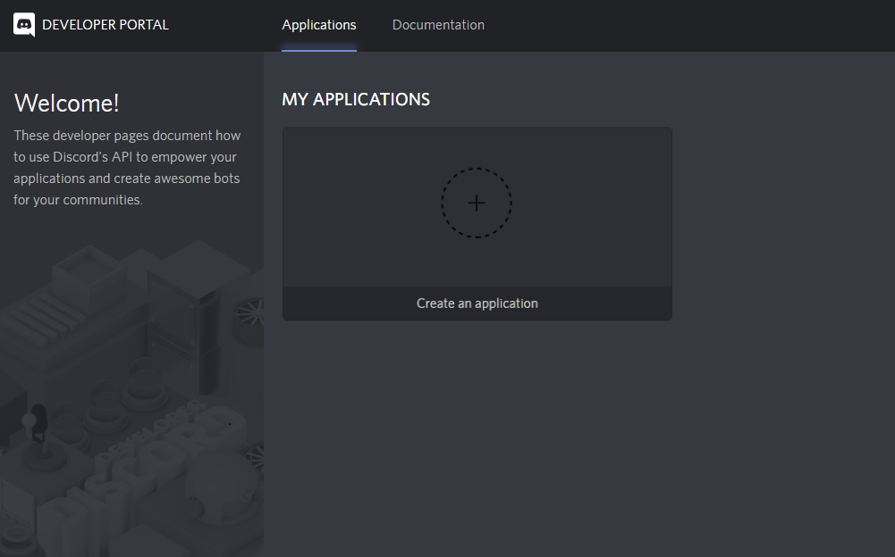

Haga clic en __Crear una Aplicacion__\. Esto lo llevará a la siguiente página, donde debe ingresar un nombre para la aplicación y un avatar/icon \(el nombre de la aplicacion sera para el bot inicial\)\. La descripción para la aplicación es opcional\.

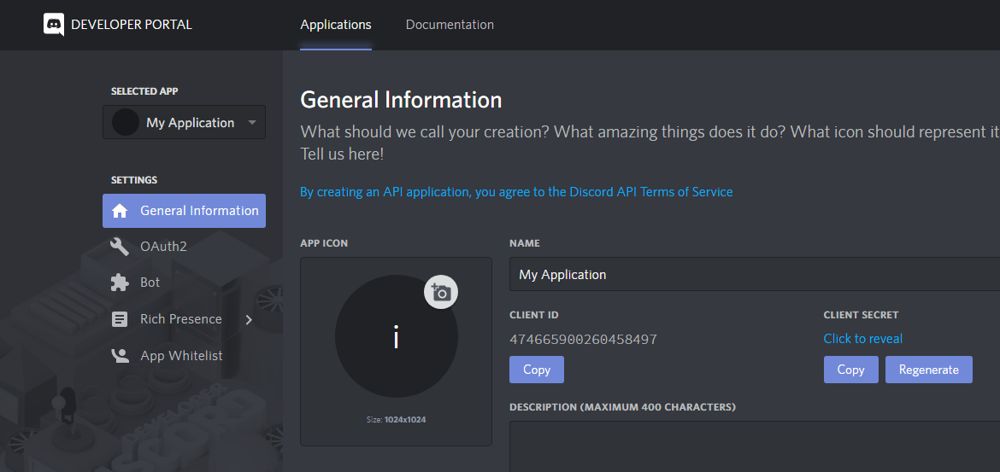

Luego de ingresar todo los datos de la siguiente manera:

Clic en el boton __Save Change__ en la parte de abajo\.

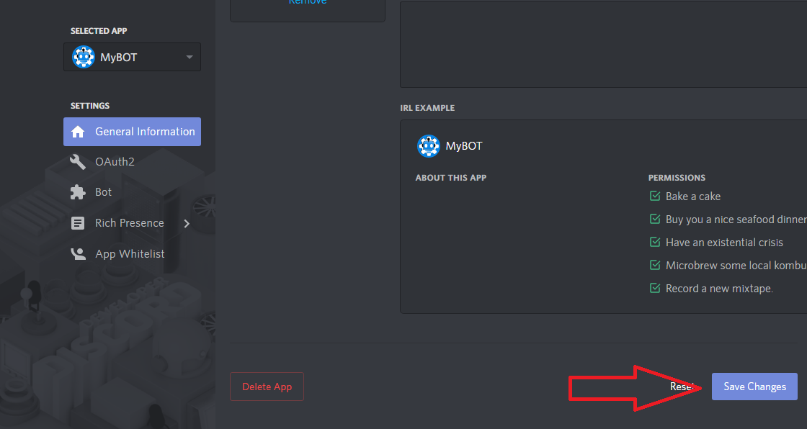

  
__CREAR UN USUARIO BOT__

Despues de crear la aplicación, ir a la opción __Bot__, y hacer clic en __App Bot__\.

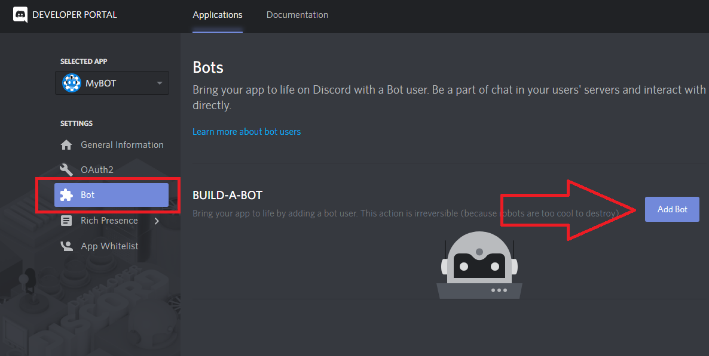

Luego damos clic en __Yes, Do it\!__\.

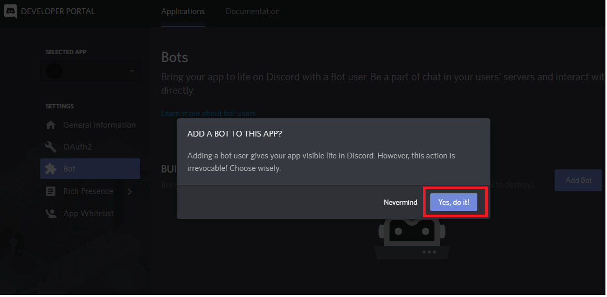

Usted a completado el proceso de crear la aplicación y su bot, darle clic en __Public Bot__

__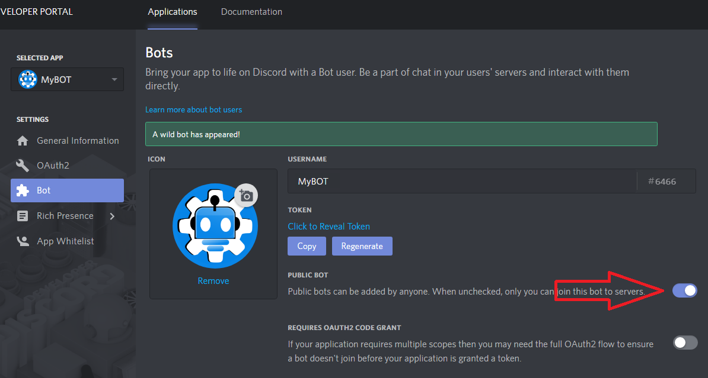__

Si esto es así, haga clic en __save changes__ para guardar la configuración\.

  
__OBTENER EL TOKEN DE SU BOT__

__ATENCION__: Esta parte es realmente importante, el token de su bot está destinado a ser __SECRETO__\. Es la forma en que Discord autentica su bot, asi como cuando inicias sección con un nombre de usuario y una contraseña\. Revelar su token es como poner su contraseña en publico, si su token llega a ser publica y usado por otros, cámbielo de inmediato\.

El Token es secreto, como lo acabo de mencionar, es la forma en que su bot se autentica a discord\.

Para obtener su token, ir a la opción de Bot, y hacer clic en __Generate__\.

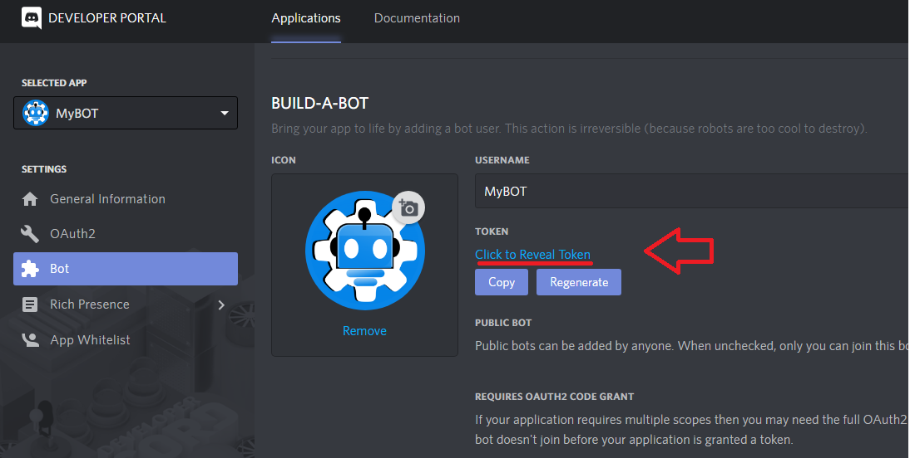

A continuación, se visualizara su token secreto\.

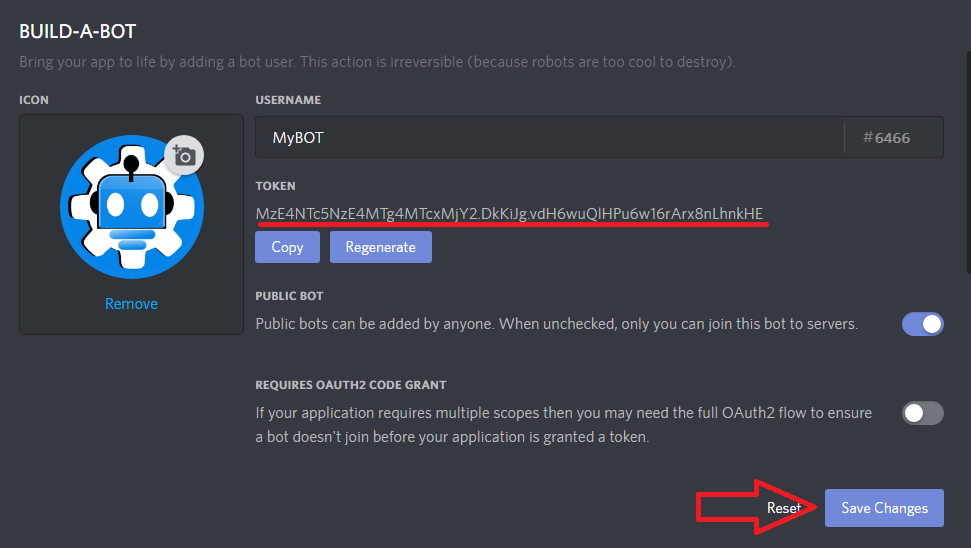

__NOTA__: El token mostrado en este ejemplo no es válido\. También asegúrese de copiar y guardar el Token para utilizarlo mas adelante\.

  
__AGREGE SU BOT A UN SERVIDOR__

Bien, incluso si no ha escrito ni una sola línea de código para su bot, ya puede invitarlo a un servidor\.

Para invitar a su bot, necesita los permisos de __"ADMINISTRADOR"__ del servidor a donde agregara el bot o ser el creador\. De esa forma podra agregar su bot\.

Copiar el ID de su bot, en la pagina de la aplicacion\.

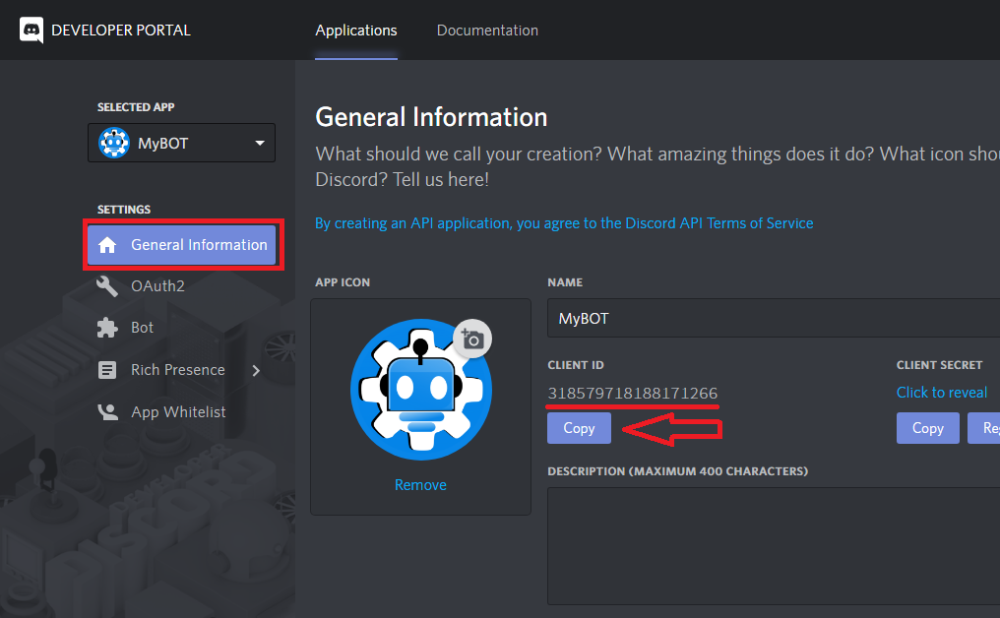

Para generar el link de invitación de su bot utilizaremos una herramienta API de permisos, diríjase a esta pagina [discordapi\.com/permissions](https://discordapi.com/permissions.html#3145736) para generar el link de invitacion\.

Pegar del ID del bot en __Insert Client Id here__ de la siguiente forma\.

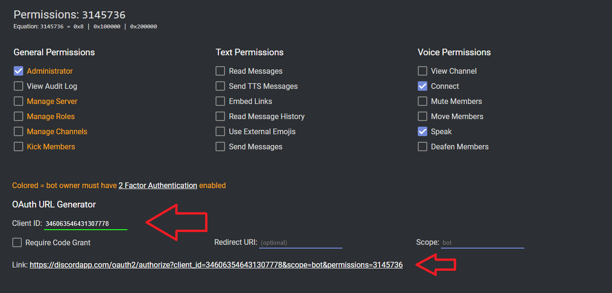

Abrir el link de invitación generado, se muestra una ventana que le permite elegir el servidor donde podra agregar su bot, simplemente seleccione el servidor y haga clic en __Autorizar__\.

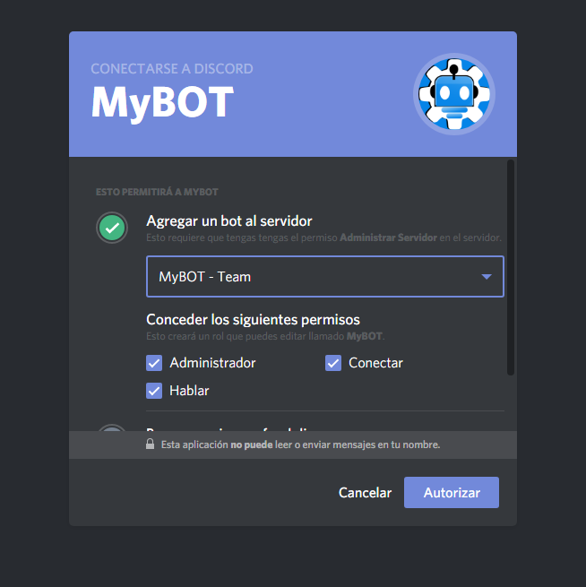

Una vez echo todos los pasos su BOT se a unido al servidor seleccionado\.

__NOTA__: Sólo puede agregar un bot a los servidores donde tenga permisos de __ADMINISTRACION__ o ser el dueño del servidor\.

El bot ingresara al servidor en estado de Desconectado, mas adelante veremos como activar el bot\.

__¡Éxito\! Ahora tiene su bot agregado a su servidor, es hora de comenzar con el entorno de la programación\.__

__PASO 3 INSTALACION DE DISCORD\.JS Y NODE\.JS__

Para usar discord\.js y empezar a programar necesitará un par de cosas instaladas\. Por lo menos:

  Node\.js v8 o superior\.

  Tener un editor de codigo real\. Si no tienen instalado un editor de codigo ir a la sección editor\-de\-codigos

  
__INSTALACION DE NODE\.JS__

Node es un entorno de ejecución para JavaScript, usa un modelo de operaciones E/S sin bloqueo y orientado a eventos, que lo hace liviano y eficiente\.

Para instalar Node, vamos a la siguiente pagina web [Nodejs\.org](https://nodejs.org/en/)

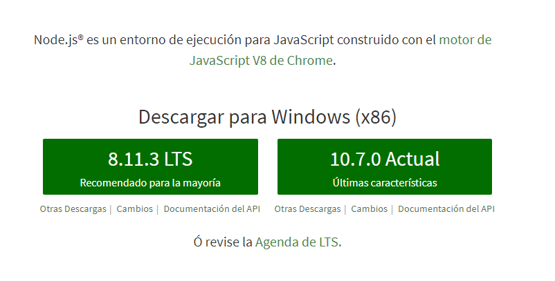

Descargar la versión recomendada e instalar en su PC\. \(Reinicié su PC si es necesario\)

  
__PREPARACION DEL ENTORNO DE PROGRAMACION DE SU BOT__

Una vez que tenga el software requerido, el siguiente paso es preparar un espacio para empezar a programar\.

  Crear una carpeta en el escritorio o en una unidad de disco duro o partición\.

  Darle un nombre a la carpeta \(Ejm\. BOT, BotDiscord, MyBOT, etc\.\)

  Una vez que haya creado una carpeta, abrir la consola \(interfaz de línea de comandos\) con al ruta de la carpeta\.

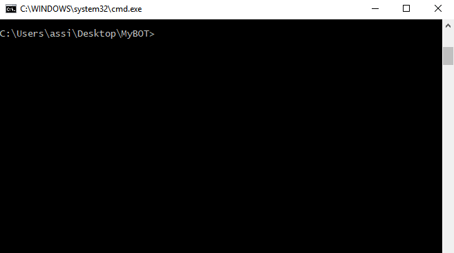

__Si no pudo abrir la consola con la ruta, sigue estos pasos: \(en Windows\)__

  Presionar la tecla de __windows\(⊞ Win\) \+ R__ y escribir "cmd", luego clic en __Aceptar__ para abrir la consola\.

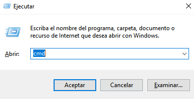

  Una vez dentro de la consola escribir lo siguiente: __cd desktop\\MyBOT__ \(MyBOT es el nombre de la carpeta creada\)\.

Listo, ahora vayamos al siguiente paso\!

  
__INSTALACION DE DISCORD\.JS__

Una vez dentro de la consola con la ruta de la carpeta, vamos a instalar Discord\.js\.

Pero primero vamos a inicializar esta carpeta con node y npm \(NPM = Node Package Manager \- Administrador de paquetes/librerias de node\), esto asegurará que cualquier otro módulo instalado se instale dentro de la carpeta\.

Para iniciar escribir dentro de la consola __npm init \-y__ , luego pulse enter dentro de la consola\.

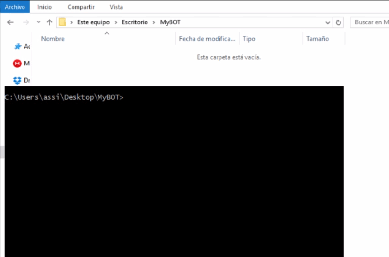

Se creara un nuevo archivo llamado __package\.json__ significa que has iniciado correctamente\. Si desea saber mas información sobre package\.json haga [clic aquí](https://docs.npmjs.com/files/package.json)\.

Ahora instalamos __Discord\.js__ a través de npm:

Escribir __npm install discord\.js \-\-save__ en la consola y pulse enter\.

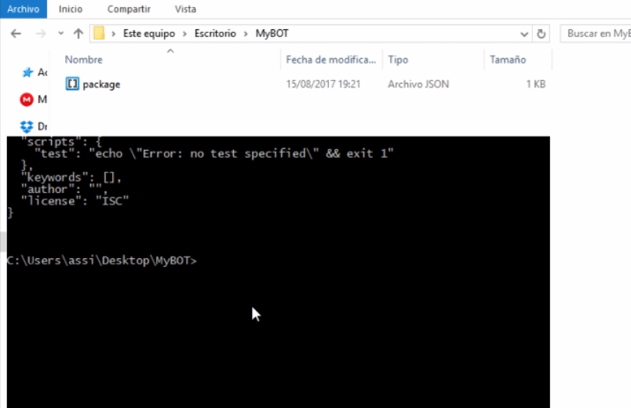

__NOTA:__ "\-\-save" es para asegurar que se guarde en el package\.json que creamos anteriormente\.

La instalación es muy rapida y mostrara el proceso de la instalacion en la pantalla de la consola\.

Una vez completada la instalación de __Discordjs__, nos fijamos en la carpeta y se dará cuenta de que hay una nueva carpeta creada llamada __node\_modules__\. Esto contiene todos los paquetes instalados para el funcionamiento de __Discordjs__\.

  
__Significa que Discord\.js se a instalado correctamente\. ¡Bien hecho\!, ahora vayamos a poner en marcha su primer bot\.__

__PASO 4 EN MARCHAR MI PRIMER BOT__

Empezamos a codificar los eventos y funciones para desarrollar su BOT, con una estructura basica de inicio\.

__NOTA__: se supone que usted ha seguido el capitulo de creación de su cuenta app e instalación de discord\.js, antes de seguir con este capítulo\. Tambien usted esta apunto de ver codigo \.JS \(Lenguaje de programación JavaScript\), si no entiende o no tiene conocimientos de JavaScript recomendamos ir a __[CodeAcademy](https://www.codecademy.com/learn/javascript" \t "_blank)__ y aprender los basico de JavaScript\.

Comencemos:

  Abrir la carpeta de su BOT creado, con Visual Studio Code o con el editor que tenga instalado\.

  Crear un nuevo archivo y darle un nombre con la extencion \.js \(archivo JavaScript\)\.

  Ejemplos: mybot\.js, bot\.js, app\.js, etc\. __\(Para esta guía utilizaré mybot\.js\)__

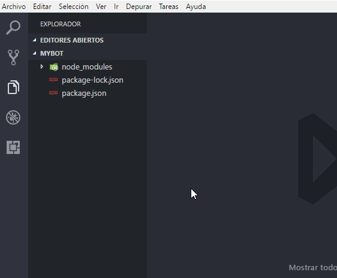

Luego de crear el archivo para su BOT, dentro del archivo agregamos las siguientes lineas de codigo:

const Discord = require\("discord\.js"\);

const client = new Discord\.Client\(\);

__Descripción de lo agregado__

__const__ crea una variable __Discord__ para referenciar el modulo npm __discord\.js__ instalado anteriormente\.

__const__ crea la varible __client__ para crear una nueva clase __Client\(\)__ de la variable __Discord__ referenciado, __client__ representa a la clase __Client\(\)__ que es el eje principal para interactuar con la API de Discord, y el punto de partida para cualquier BOT\.

Agregamos las siguientes lineas de codigo debajo de las variables creados\.

client\.on\("ready", \(\) => \{

   console\.log\("Estoy listo\!"\);

\}\);

client\.on\("message", \(message\) => \{

  if\(message\.content\.startsWith\("ping"\)\) \{

    message\.channel\.send\("pong\!"\);

  \}

\}\);

client\.login\("TokenSecreto"\);

__Descripción de lo agregado__

En la primera linea la varible __client__ activa el evento llamado __ready__, ready es el evento de inicio cuando se activa un BOT en __discord\.js__, se puede ingresar un mensaje o funcion que se ejecutara cuando el BOT se aya activado correctamente\.

Utilizamos tambien el evento __message__, message es el manejador de los mensajes y argumentos de un servidor, detro del mismo podemos crear comandos\(__funciones__\) para su BOT\. Un ejemplo basico es el comando __ping__\. dentro de una condicion __if\(\)__ basica\.

Y por ultimo y no menos importante la funcion __login__, que se encarga de iniciar seccion de su BOT \(loggear\) y autenticarlo con la API de Discord\.

__Esta es la estructura de eventos y funciones para iniciar un BOT con discord\.js de forma basica\.__

const Discord = require\("discord\.js"\);

const client = new Discord\.Client\(\);

client\.on\("ready", \(\) => \{

   console\.log\("Estoy listo\!"\);

\}\);

client\.on\("message", \(message\) => \{

  if\(message\.content\.startsWith\("ping"\)\) \{

    message\.channel\.send\("pong\!"\);

  \}

\}\);

client\.login\("TokenSecreto"\);

Ok, luego de agregar las lineas de codigos, ahora reemplace en la linea de la función __client\.login\("TokenSecreto"\)__ por el __Token__ de su BOT creado anteriormente\.

Y guardar todo utilizando __\(CONTROL \+ S\)__\.

__¡Listo\!, una vez copiado la estructura de inicio y reemplazado el token, es hora de activar su BOT\.__

__ACTIVACION MEDIANTE CONSOLA__

La manera de activar un BOT mendiante la consola de windows, es ingresando a la ruta de la carpeta de su BOT\. y utilizar el comando de nodejs llamada __node__, mas el nombre del archivo del bot:

El comando __node__ genera un tunel localmente\.\.\.

  Ejemplo: __node mybot\.js__ ó __node mybot__ sin la extenciòn \.js, las dos formas generan la misma acción\.

Si en su consola aparecio un mensaje __Estoy listo\!__ generado por el evento __ready__, su BOT estara conectado en su servidor invitado\.

__\!Genial¡__ su bot esta listo para responder a todas sus órdenes, en el ejemplo de la estructura basica su BOT respondera con un mensaje __pong\!__, a cualquier mensaje que empiece exactamente con __ping__ del evento __message__, vamos a comprobarlo\.

__¡Éxito\! tienes tu BOT ejecutándose\!, ahora podras crear muchas funciones y comandos para su BOT\. La activación de su primer BOT se ha completado\.__

  

__¿QUE SIGUE?__

Usted tiene desarrollado un BOT básico, es hora de comenzar a agregar nuevas características\!\.

__PASO 5 USO DE UN PREFIX__

Usted puede ser que haya visto en muchos bots que responden a los comandos con un prefix unico y específicio\. Ya se un signo de exclamación __\!__, un signo de __\+__, un signo de interrogación __?__ u otros carácteres\. Esto es muy útil para:

En primer lugar, si no utiliza un prefix único y tiene más de un BOT en un servidor, ambos responderán a los mismos comandos\.

En segundo lugar, en el ejemplo basico su BOT responden cuando el mensaje comienza con __ping__ que son 4 caracteres, esto significa que la siguiente frase provocará la respuesta del BOT\.

Para evitar todo estos casos se usa un prefix unico, vamos a crear un prefix, así como la capacidad de cambiar el prefix cuando guste desde un solo lugar\.

__Bien, hay dos formas de poder crear y usar una variable como prefix:__

  1\. Creando una varible dentro del mismo archivo __mybot\.js__ como prefix\.

  2\. Dividir en partes la configuración de variables, creando un archivo __\.json__

Vamos por la forma mas recomendada, __crear un archivo \.json para nuestra configuración de variables\.__

  

__AGREGANDO UN ARCHIVO JSON PARA NUESTRAS VARIBLES__

  Crear un nuevo archivo y darle el nombre de __config\.json__ \(\.json es la extencion del archivo\)\.

__JSON__, son notaciones de objetos para javascript\.

Ahora que ya hemos creado el archivo de configuración hay 3 cosas de inicio que podemos agregar al archivo, son:

  El token de su BOT

  El prefix de su BOT

Entre otras cosas mas\.

Agregar las siguientes lineas de configuración dentro del archivo __json__ creado\.

\{

"token":"tokenSecreto",

"prefix":"\-"

\}

                                                

Despues de agregar usted puede cambiar el objeto __prefix__ con el simbolo de su prefix para su BOT, para el ejemplo usare el simbolo __\-__ como prefix\. Tambien copie el token de su BOT en el objeto __token__ del archivo de configuración\.

Guarde la configuración usando __CONTROL \+S__

  

__REFERENCIANDO EL ARCHIVO DE CONFIGURACION JSON__

Nos dirigimos a la parte superior del archivo de su BOT __mybot\.js__, agregamos una nueva línea de codigo para referenciar al archivo config\.json mediante una variable\.

const config = require\("\./config\.json"\);

__Descripción de lo agregado__

__const__ crea una variable __config__ para referenciar al archivo de configuración __config\.json__ creado anteriormente\.

  

Ahora usted utilizara la variable __config__ para llamar a los __objetos__ que estan dentro del archivo de configuración __config\.json__\.

  Para llamar o utilizar el objeto __prefix__ escribimos: __config\.prefix__

  Para llamar o utilizar el objeto __token__ escribimos: __config\.token__

  

__USANDO LA VARIABLE CONFIG__

Vamos a usar la variable __config__ que representa el archivo de configuración, primero cambiamos el token llamando al objeto __token__ mediante la variable __config__\.

La linea de nuestro bot se ve así:

client\.login\("MzASfasFWf\_asdASDKKW\-SFASfasFWf\#f3KKsds51\.sDSd"\);

Usando __config__ y el objeto __token__ seria así:

client\.login\(config\.token\);

Listo, la otra linea que tenemos que agregar es el objeto __prefix__, vamos a la linea de nuestro codigo debajo de config y agregamos el prefix creando una nueva variable para los comandos, de esta forma

let prefix = config\.prefix;

  

Despues de agregar y referenciar nuestro archivo de configuración __config\.json__ a nuestro BOT, esto se deberia de ver así:

const Discord = require\("discord\.js"\);

const client = new Discord\.Client\(\);

const config = require\("\./config\.json"\);

let prefix = config\.prefix;

client\.on\("ready", \(\) => \{

   console\.log\("Estoy listo\!"\);

\}\);

client\.on\("message", \(message\) => \{

  if\(message\.content\.startsWith\(prefix \+ "ping"\)\) \{

    message\.channel\.send\("pong\!"\);

  \}

\}\);

client\.login\(config\.token\);

Ahora agregamos un nuevo comando de ejemplo basico para probar con el nuevo prefix

__NOTA:__ Los nuevos comandos que agregemos deben estar dentro del evento __message__ y siempre debe de abrir y cerrar las llaves __'\{ \}'__, es importate para que pueda interactuar con los mensajes de un servidor a travez de condiciones y funciones agregadas\.

__Ejemplo: 1__ Creamos una nueva condicion __if\(\)__ debajo de nuestro comando __ping__

if\(message\.content\.startsWith\(prefix \+ "hola"\)\) \{ 

     message\.channel\.send\("Hola que tal?"\);

\}

Despues de agregar, la estructura de su BOT se deberia de ver así:

const Discord = require\("discord\.js"\);

const client = new Discord\.Client\(\);

const config = require\("\./config\.json"\);

let prefix = config\.prefix;

client\.on\("ready", \(\) => \{

   console\.log\("Estoy listo\!"\);

\}\);

client\.on\("message", \(message\) => \{

  if\(message\.content\.startsWith\(prefix \+ "ping"\)\) \{

    message\.channel\.send\("pong\!"\);

  \} else

  if\(message\.content\.startsWith\(prefix \+ "hola"\)\) \{ 

     message\.channel\.send\("Hola que tal?"\);

  \}

\}\);

client\.login\(config\.token\);

Luego de agregar, guardar todo usando __\(CONTROL \+ S\)__\.

Como hemos visto agregamos el nuevo comandos dentro del evento __message__ con una condicion __if__ donde se describe de esta manera: __Si el contenido del mensaje enviado en el servidor empieza con el prefix mas hola \(\-hola\), devuelveme: hola que tal?\.__

  

Vamos a activar nuevamente su BOT y comprobar los cambios con el nuevo prefix agregado\. Pero antes, para desactivar o apagar un BOT en consola es presionando __CONTROL \+ C__

__Prueba:__

__Genial\!__, su BOT ahora responde a los comandos atravez del prefix creado\.

  

__PREVENCION DEL BUCLE INFINITO__

Hay una última cosa de la que quiero hablar: __¿los bots se contestan?__, ¡si\! y esto se debe a que si usted tiene 2 bots con el mismo prefix en su servidor y cada uno debe responder a la orden del mismo prefix, ejemplo __\-help__\. Ahora si una persona escribe __\-help__ en un canal y ambos bots responden, y uno de los bots verá la respuesta como una consulta y se contestarán a cada momento\. A eso se le denomina como un bucle infinito: __"repetir lo mismo sin detenerse\."__

Para evitar que esto ocurra, debemos agregar dos condiciónes dentro del evento __message__, al inicio:

if \(\!message\.content\.startsWith\(prefix\)\) return; 

if \(message\.author\.bot\) return;

__Descripción de lo agregado__

La primera condicion nos dice que si el contenido del mensaje no empieza con nuestro prefix, retorne nada o detenga las funciones\.

La segunda condicion nos dice que si el contenido del mensaje fue enviado por un BOT, retorne nada\. __Esto es importante para evitar los bucles infinitos\.__

  

Entonces, luego de agregar nuestro archivo de configuración y las condiciones de prevención tenemos un BOT que sólo responde a 2 comandos con nuestro prefix, __¿Es esto un bot básico completado? ¡Por supuesto\!__\.

