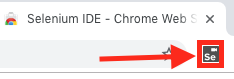
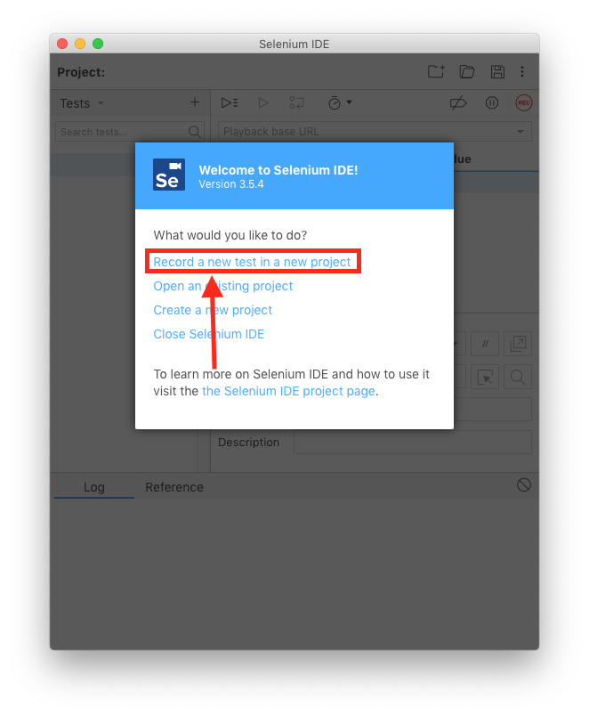
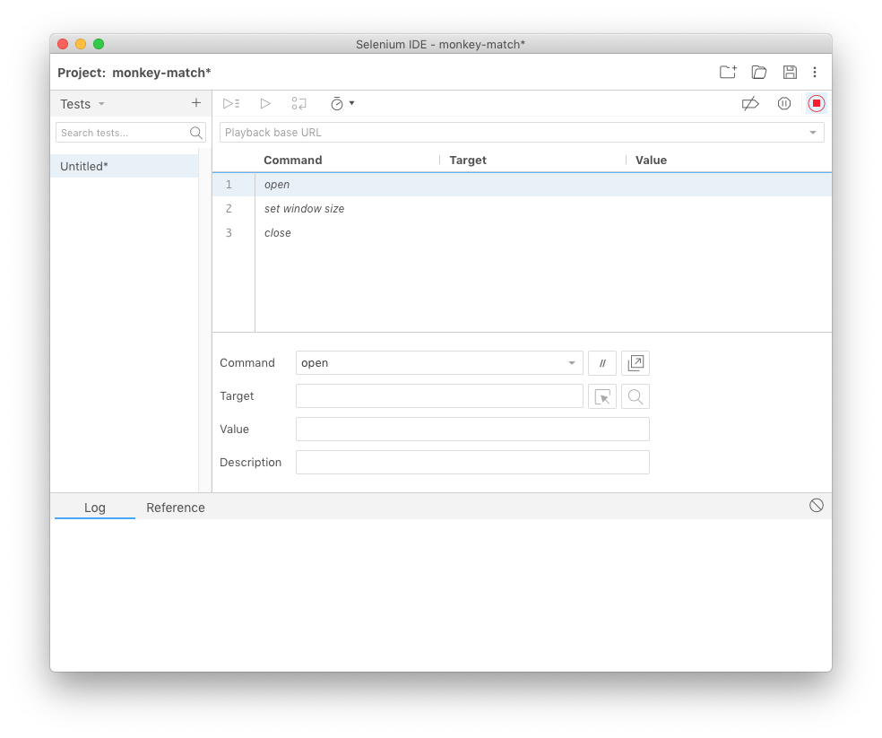
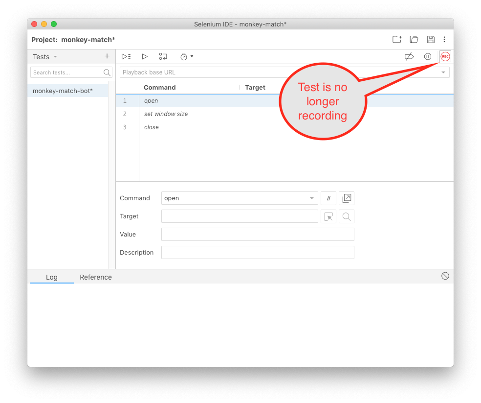
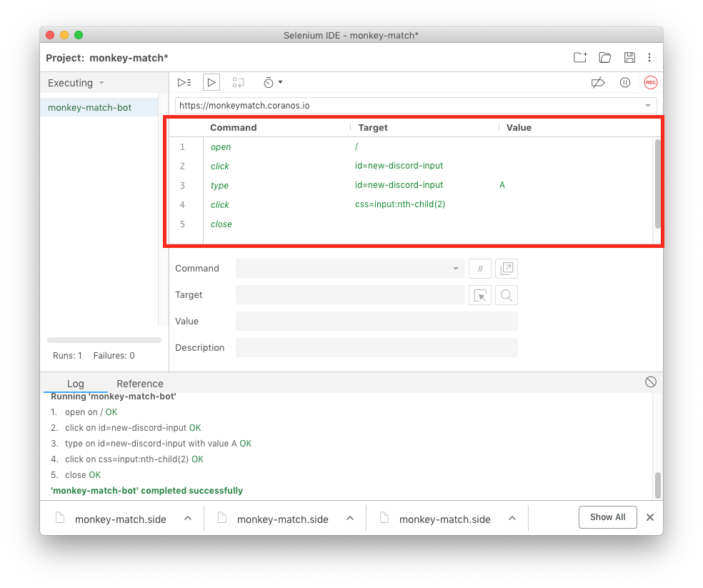

# Lesson Eleven, using selenium

## 11.1 using google chrome, install the selenium ide extension for chrome

https://chrome.google.com/webstore/detail/selenium-ide/mooikfkahbdckldjjndioackbalphokd

## 11.2 open the selenium ide from within google chrome.

## 11.3 record a new test in a new project.

use the project name "monkey-match"

use the base url "https://monkeymatch.coranos.io"

it will start recording automatically, stop the recording.

save the test as "monkey-match-bot".

save the project as "monkey-match.side".

## 11.4 botting the game - logging in.

start recording and then:

1) click on the input field.
2) type "a".
3) click "submit".
4) close the browser.
5) click "end recording".

You will see that selenium recorded what you did.

Selenium can record any actions you do.
